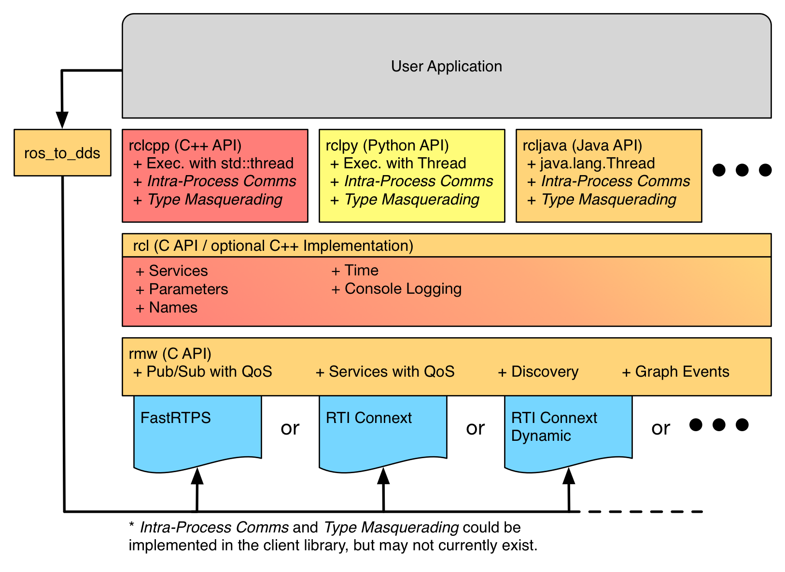
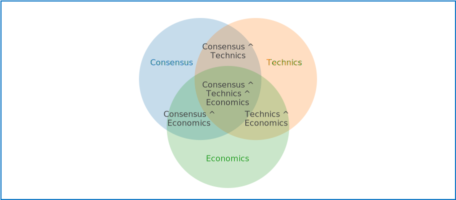

:Authors:
    Aleksandr Krupenkin <mail@akru.me>

:Version: 2 of 2021/01

Robonomics Network 2.0
======================

    This document is technical specification for Rust developers.
    It could be used for implementing basic protocols and abstractions of Robonomics Network.
    Most part of described concepts is very experimental and wasn't well tested in real cases.

Робономика в тезисах
~~~~~~~~~~~~~~~~~~~~

1. Робономика - это **сеть**.
2. Основная задача **сети** - совместное ведение хозяйства людей и машин.
3. Совместное ведение хозяйства возможно на основании **обязательств**.

Провадер Робономики
~~~~~~~~~~~~~~~~~~~

Ключевой элемент **сети** - **провайдер**. **Провайдер** предоставляет набор **сервисов**
достаточный для выполнения задач **сети**.

**Сервисы**

1. Самоидентификация - возможность участников сети найти провайдера и получить доступ к сервисам.
2. Реестр спроса и предложения - открытая книга заказов на ведение хозяйственной деятельности.
3. Регистрация обязательств - поселение факта сделки и протокола выполненных работ в хранилище, защищённое консенсусом. (blockchain)
4. ...

    Список может быть исправлен и дополнен.

Robonomics Network as L{n} abstraction
~~~~~~~~~~~~~~~~~~~~~~~~~~~~~~~~~~~~~~

Определение робономики не через блокчейн, а как сети, даёт хороший уровень абстракции
над существующими на данный момент технологиями. Ключевой момент в исполнении сетью
задачи - средства вторичны.

В мае 2019 в сети Ethereum был запущен L2 слой сети Робономики, который позволяет
использовать децентрализованный компьютер Ethereum для безопасного заключения сделок
между человеком и машиной.

Абстрагируясь ещё больше и вынося на передний край провайдеров сети мы получаем
L3 слой сети Робономики. На нижних уровнях находятся поддерживаемые Робономикой
децентрализованные компьютеры (хранилища данных + вычисления защищённые консенсусом).
На уровне L3 находятся сервисы, необходимые для выполнения основной задачи сети.

**Архитектура провайдера L3 сети**

Проблемы текущего провайдера:

- Обратная связь / Онлайн
- Обновление (актуализация протокола)
- Администрирование / Тонкая настройка

Отличия провайдера нового поколения:

- Прямое соединение агента с провайдером через libp2p stream (вместо PubSub канала)
- Провайдер предоставляет расширяемый набор libp2p-сервисов
- Провайдер предоставляет интерфейс пользователя (WebUI) для администрирования / тонкой настройки

Архитектура провайдера в Робономике L3 принципиально отличается от провайдера L2 (xrtd):
основа сети L3 - множество независимых провайдеров сервисов совместного ведения хозяйства человека и машин.
В отличие от Робономики L2, в которой клиенту предоставляется сервис торговли обязательствами,
естественно необходимый для совместного ведения хозяйства. Однако L3 имеет более общую структуру,
инкапсулируя L2 и позволяя бесшовно заменять нижние слои или использовать их одновременно.
Например, модуль поддержки обязательств в Ethereum может работать совместно с регистрацией обязательств в парачейн.

Robonomics as ROS2 middleware
~~~~~~~~~~~~~~~~~~~~~~~~~~~~~

    The underlying middleware used for ROS 2 is either a DDS or RTPS implementation,
    and is responsible for discovery, publish and subscribe mechanics, request-reply
    mechanics for services, and serialization of message types.

Сеть Робономики может рассматриваться как слой коммуникации в робототехнике. Для этого в ROS 2 вводится
понятие RMW (ROS MiddleWare). RMW это заменяемый слой обеспечивающий доставку данных между процессами ROS.

Правила доставки данных в различных слоях RMW могут сильно различаться. Например, RMW использующий радиочастоты
для доставки сигнала по своим характеристикам и области применения может сильно отличаться от RMW на основе TCP/IP.
Здесь, сеть Робономики может устанавливать собственные ограничения, экспортируя в пространство ROS 2 через интерфейс RMW
технико-экономическую парадигму взаимодействия кибер-физических систем.

**Режимы коммуникации**

* Realtime: используется быстрый и бесплатный libp2p Gossipsub для доставки данных без гарантий доставки и следа.
* Blockchain: используется медленный и дорогой substrate для надежной доставки данных с невозможностью подменить их в будующем.

**Сервисная модель**

За основу возьмем сервисный подход из ROS: http://wiki.ros.org/Services

Исполнение сервисов зависит от режима работы клиента.

В **realtime** режиме соединение с исполнителем происходит напрямую (P2P),
это позволяет решать много задач, в основе которых лежит условие доверия клиента исполнителю.

В режиме **blockchain** арбитром работы сервиса становится децентрализованный компьютер. Это значит,
что для предоставления сервиса не требуется доверие между исполнителем и клиентом. А значит эта модель
подходит для предоставления реальных сервисов без участия человека или курирующей организации. 

The MultiLiability
~~~~~~~~~~~~~~~~~~

Обязательственное отношение в Робономике выполняет ключевую функцию:
объединяет экономическую и техническую часть транзакции от человека к машине.

**Жизненный цикл обязательства**

В Робономике обязательственное отношение имеет три стадии:

1. **Неполное обязательство**: параметры создания до конца не определены, например, отсутствует исполнитель.
2. **Открытое обязательство**: соблюдены необходимые условия создания обязательства, робот может приступать к исполнению, экономическая часть транзакции защищена консенсусом.
3. **Закрытое обязательство**: соблюдены необходимые условия финализации обязательства; экономическая транзакция завершена, протокол выполненных работ опубликован.

    Инсентивизация достижения всеми обязательствами стадии 3 является основной задачей токена L2 сети.

Минимальный набор параметров создания обязательства:

1. идентификатор технических данных (обычно файл с техническими параметрами в ipfs);
2. идентификатор экономических данных (обычно процессинговый токен и стоимость);
3. идентификатор куратора обязательства (опционально);
4. криптографическое подтверждение согласия кредитора с условиями обязательства (обычно эцп от 1,2)
5. криптографическое подтверждение согласия исполнителя с условиями обязательства (обычно эцп от 1,2)

Минимальный набор параметров финализации обязательства:

1. Идентификатор протокола выполненных работ (обычно ROSBAG-файл протокола работ в ipfs);
2. криптографическое подтверждение согласия исполнителя с протоколом выполненных работ (обычно эцп от 1)
3. криптографическое подтверждение согласия куратора с протоколом работ (обычно эцп от 1; опционально)

**Исполнение обязательств**

Формально исполнение обязательства можно разделить на несколько независимых частей:

1. Автономный экономический процесс защищённый консенсусом (например, смарт-контракт Ethereum).
2. Сервисы провайдеров Робономики (например, имплементация Робономики от Airalab).
3. Физические действия в материальном мире (например, движение манипулятора робота под управлением ROS).

Каждая часть независима и заменяема. Сервисы провайдеров являются мостом между автономными процессами в децентрализованных компьютерах и изменениями, произведёнными роботами в материальном мире.

Требования к автономным процессам (децентрализованным компьютерам):

- Защита данных консенсусом (автономность);
- Возможность включать в транзакцию произвольные данные (технические параметры);
- Поддержка криптографии с открытым ключом (или иного способа верификации согласия каждой из сторон обязательства);
- Возможность реализации простого конечного автомата (жизненный цикл обязательства).

Исполнение обязательства со стороны робототехнической системы не требует наличия связи с провайдером Робономики. Достаточно иметь связь с децентрализованным компьютером, в котором возникают обязательства  этого агента.

**Идентификатор обязательства**

Абстрагируясь от способа исполнения обязательств введём понятие идентификатора. Универсальный идентификатор позволяет однозначно определить децентрализованный компьютер и положение обязательственного отношения в нем. Сам идентификатор не защищён консенсусом поэтому агент сети обязан валидировать идентификатор самостоятельно. Тем не менее провайдеры сети могут предоставлять вспомогательные сервисы поиска и отслеживания обязательств без гарантий корректности данных.

**Формат универсального идентификатора**

1. Заголовок:

+-------------+------------------+--------+
| Position    | Field Name       | Data   |
+=============+==================+========+
| 0x00..0x02  | Magic bytes      | 0x0163 |
+-------------+------------------+--------+

2. Код децентрализованного компьютера:

+------------+------------+------+
| 0x02..0x03 | Ethereum   | 0x01 |
+------------+------------+------+
| 0x02..0x03 | Robonomics | 0x02 |
+------------+------------+------+
| 0x02..0x03 | Tezos      | 0x03 |
+------------+------------+------+

3. Блок данных специфичных для конкретного хранилища.

+------------+---------------------+--------------------------------------------+
| 0x03..0x17 | Ethereum Address    | 0x4af013AfBAdb22D8A88c92D68Fc96B033b9Ebb8a |
+------------+---------------------+--------------------------------------------+
| 0x03..0x0b | Robonomics Index    | 0x0000000000000042                         |
+------------+---------------------+--------------------------------------------+
| 0x03..0x27 | Tezos Address+Index | 0x010203040500..00000042                   |
+------------+---------------------+--------------------------------------------+

Для удобства чтения и копирования универсальный идентификатор кодируется в Base58.

**Движок обязательства**

Открытое обязательство в соответствие с протоколом должно быть исполнено КФС. Для этой задачи нода Робономики содержит специальный модуль. Движок исполнения обязательств состоит из двух частей:

1. Наблюдателя(Observer), который отслеживает возникновения обязательства из различных источников;
2. Исполнителя(Executor), который выгружает обязательство, интерпретирует и запускает процесс исполнения внутри робототехнической системы.

Наблюдатель предполагает модульную структуру с возможностью добавления новых источников обязательств: EthereumObserver, ParachainObserver, TezosObserver, etc.

Исполнитель в свою очередь состоит из нескольких частей:

1. Провайдера контента обязательства (ContentProvider).
2. Интерпретатора параметров обязательства (ContentInterpreter).
3. Интеграционного модуля системы КФС ({CPS}Integration).

Первые два модуля так же являются ориентированными на конкретный тип децентрализованного компьютера, например EthereumContentProvider. Третий модуль зависит от типа КФС для интеграции, например ROSIntegration модуль позволяет исполнять обязательства роботами, поддерживающими ROS.

Robonomics pairing service
~~~~~~~~~~~~~~~~~~~~~~~~~~

Этот сервис упрощет процесс связывания устройств к которым имеется физический доступ, но нет
возможности или навыков внести изменения в программное обеспечение устройств.

Для начала необходимо создать ключ идентификации устройства, этот шаг может быть выполнен зарание,
а ключ размещен на устройстве в виде штрих-кода (QR).

    robonomics key generate

Следющим шагом является введение устройства в режим сопряжения, обычно зажиманием специальной комбинации клавиш
или запуском специальной команды (кнопки).

    robonomics pair listen --key ...

Финальным шагом является отправка команды с терминала клиента на подключение устройства. В данном случае идентификатор
может быть введен вручную, либо при помощи QR-кода. 

    robonomics pair connect 5b...

На этапе подключения клиент отправляет широковещательный запрос в сеть в поисках узла с искомым идентификатором.
Здесь может использоваться DHT или PubSub рассылка. Устройство при получении зашифрованного Hello сообщения в свой адрес,
пытается подключиться к клиенту напрямую либо при помощи relay-ноды. Когда соедниение установлено, клиент и устройство обмениваются информацией для поддержания соеднения и управления устройством.
